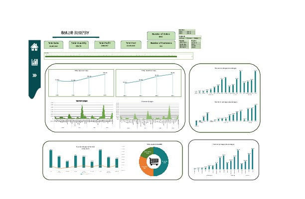
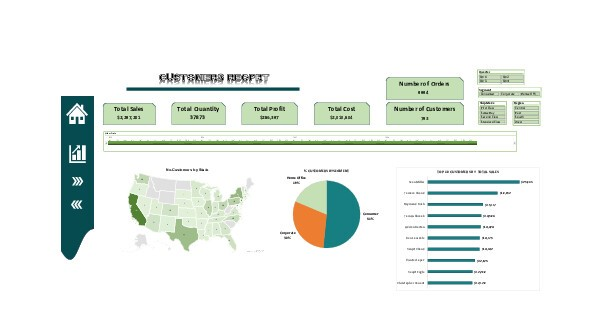
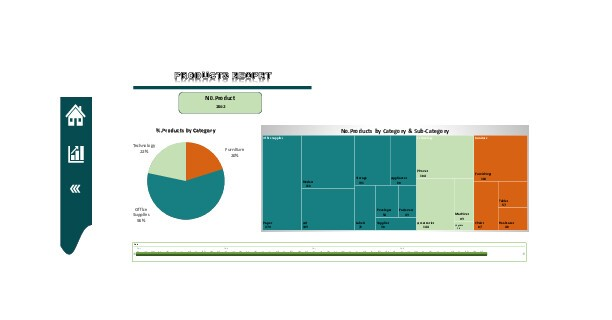

# Sales-Excel-Project
Data Analysis Sales Project Using Excel & Power Query

# 📊 Sales Report Data Analysis 

Welcome to the **Sales Report Analysis** repository! This project provides a detailed analysis of sales data using **Excel** and **Power Query**. Below is a summary of the key features and insights presented in the report. 

  
*Demo of the Sales Analysis Workflow*

## 🚀 Features

- **Automated Data Cleaning** using Power Query.
- **Interactive Dashboards** with multiple tabs for easy data exploration.
- **Sales Overview**, **Customer Product** Analysis, and detailed **Model Tables**.

---

## 🖥️ Overview Tab

The **Overview** tab provides a high-level view of the entire sales data, with key metrics such as:
- Total Revenue 💰
- Number of Customers 🧑‍🤝‍🧑
- Best-Selling Products 🛒

Here's a snapshot of the **Overview** dashboard:



## 👥 Customer  Tab

The **Customer ** tab digs deeper into customer-specific data, helping to answer questions such as:
- Who are our top customers? 🏆




## 📑 Product Tab

The **Product ** tab digs deeper into product-specific data, helping to answer questions such as:
- Which products are performing best? 📦



---

## 🛠️ Tools Used

- **Excel**: For creating data visualizations and summaries.
- **Power Query**: For efficient data cleaning and transformation.

---

## 📈 How to Use

1. Clone the repository to your local machine.
   ```bash
   git clone https://github.com/yourusername/sales-report-analysis.git
